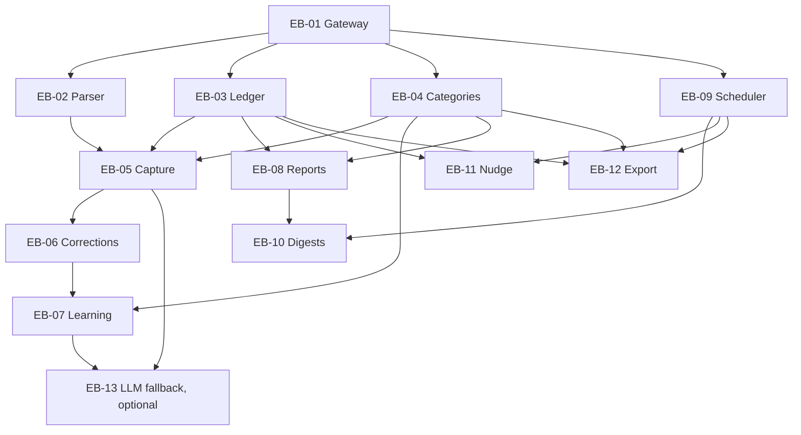

# Expense Bot MVP: Epic

**Status:** Draft for review · **Date:** 2026-09-29 · **Issues:** 13 (12 MVP, 1 optional)

## 1. Goal

Two people log household expenses by typing in a shared Telegram group, as fast as sending a chat message. A bot you own records each entry, files it under a category, and reports totals.

The MVP is done when both of you can log, fix and review a month of spending without opening anything except the Telegram group.

**Terms used in this document**

| Term | Meaning |
|---|---|
| Member | One of the two people allowed to use the bot |
| Entry | One expense in the ledger |
| Confirmation | The bot's reply to a message it logged |
| Soft delete | Marking an entry as removed without erasing it |
| Household timezone | The timezone used to decide what "today" means |

## 2. Decisions already made

| Decision | Choice | Reason |
|---|---|---|
| Platform | Telegram group with you, your wife and the bot | The only platform of the three considered where a free official bot can read a private group |
| Build or buy | Your own bot, built from scratch | Easy customization. Neither reference bot works as a fork (section 9) |
| Hosting | Cloudflare Workers, TypeScript, grammY | The free plan covers the volume, and there is no server to keep running |
| Storage | Cloudflare D1 (SQLite), one central ledger | Replaces phone-to-phone sync. Telegram delivers both phones' messages to one place |
| Parsing | Rules first, LLM only as an optional fallback | Fast, testable, and keeps working during an LLM outage |
| Scope | MVP tier only | Build the logging habit first |

## 3. Defaults I picked

Change any of these before creating the first change. None of them affects the issue structure.

| Setting | Default | Note |
|---|---|---|
| Household timezone | `Asia/Manila` | I assumed the Philippines |
| Currency | PHP, shown as ₱ | One currency in the MVP |
| Week | Monday to Sunday | |
| Evening nudge | 21:00 daily | Sent only when nothing was logged |
| Weekly digest | Sunday 19:00 | |
| Monthly recap | 1st of the month, 08:00 | |
| Backup | 23:00 nightly, silent, to the group | Can point to a private chat instead |
| Items per message | 10 at most | Keeps one message within D1's free-plan query limit |
| LLM fallback | Optional, model `claude-haiku-4-5` | The bot works without it (EB-13) |

**Default categories**

| Id | Name | Counts as spending |
|---|---|---|
| `groceries` | 🛒 Groceries & Market | Yes |
| `dining` | 🍽 Dining & Delivery | Yes |
| `transport` | 🚗 Transport | Yes |
| `bills` | 💡 Bills & Utilities | Yes |
| `housing` | 🏠 Housing | Yes |
| `household` | 🧹 Household | Yes |
| `health` | 💊 Health | Yes |
| `kids` | 🎒 Kids & Education | Yes |
| `family` | 🤝 Family Support | Yes |
| `gifts` | 🎁 Gifts & Occasions | Yes |
| `personal` | 🛍 Personal & Shopping | Yes |
| `fun` | 🎬 Fun & Subscriptions | Yes |
| `other` | ❓ Other | Yes |
| `transfer` | 🔁 Transfers | No |

`transfer` covers e-wallet cash-ins, ATM withdrawals and credit card bill payments. Counting those as spending would count the same money twice.

## 4. Scope

**MVP features and where they are built**

| MVP feature | Issues |
|---|---|
| Free-text entry in pesos | EB-02, EB-05 |
| Several expenses in one message | EB-02, EB-05 |
| Backdating ("yesterday") | EB-02 |
| One-line confirmation | EB-05 |
| Undo and Change category buttons | EB-06 |
| Auto-category | EB-04 |
| Learns from your corrections | EB-07 |
| Payer taken from the sender | EB-05 |
| Sunday digest and recap on the 1st | EB-08, EB-09, EB-10 |
| One evening nudge, only if nothing was logged | EB-09, EB-11 |
| CSV export | EB-12 |

**Added so the MVP can be run and tested**

| Addition | Issue | Reason |
|---|---|---|
| `/ping` and `/help` | EB-01 | Health check and discoverability |
| `/today`, `/week`, `/month` | EB-08 | Same report builder as the digest, and makes it testable on demand |
| Notice when a logged message is edited | EB-06 | Otherwise an edit looks applied when it is not |
| Nightly backup | EB-12 | Off-platform copy of the ledger on both phones |
| LLM fallback | EB-13 | Optional. Skip it and the MVP is still complete |

**Deferred** (section 12 has the full list): budgets, recurring bills, payment method, plain-language questions, month-over-month comparison, voice notes, receipt photos, income, dashboard.

## 5. Rules every issue follows

1. One message in, at most one bot message out. Later changes edit that message in place.
2. The bot never waits for a typed answer. Fixes happen by button or by sending a new message, so there is no conversation state to store.
3. Only the amount is required. Everything else has a default.
4. Money is stored as integer centavos. Totals are computed in code or SQL, never by an LLM.
5. Dates are local calendar dates in the household timezone. Timestamps are stored in UTC.
6. Nothing is hard-deleted. Undo marks an entry as removed.
7. The raw message text is always kept, so entries can be re-parsed later.
8. Reports show household totals. There is no per-person ranking.
9. Customization lives in config files: categories, keywords and schedule.
10. The bot ignores everyone except the two members in the one group.
11. Every issue ships tests that run with one command.

## 6. Architecture

```
Telegram group (2 members + bot)
        |
        |  HTTPS webhook with secret header
        v
Cloudflare Worker (TypeScript, grammY)
  gateway      verify, allowlist, process once, route
  capture      parse, categorize, store, confirm
  corrections  undo, restore, change category
  reports      /today /week /month, digest, recap
  scheduler    hourly tick runs due jobs
  export       /export, nightly backup
        |
        v
Cloudflare D1 (SQLite)            Anthropic API (optional, EB-13)
```

**Data**

| Table or file | Created by | Holds |
|---|---|---|
| `updates` | EB-01 | Raw Telegram updates and their processing status |
| `members` | EB-01 | Telegram user id and display name |
| `settings` | EB-01 | Allowed chat id |
| `expenses` | EB-03 | The ledger |
| `keyword_map` | EB-04 | Learned keywords |
| `job_runs` | EB-09 | One row per job per period |
| `day_marks` | EB-11 | Days marked as no spending |
| Categories config file | EB-04 | The category list in section 3 |
| Seed keywords config file | EB-04 | Starting keywords per category |

**Migration numbers** are assigned up front so issues in the same wave do not collide: `0001` EB-01, `0002` EB-03, `0003` EB-04, `0004` EB-09, `0005` EB-11, `0006` EB-13.

**Free-plan limits that shape the design** (checked 2026-09-29)

| Limit | Value | Effect |
|---|---|---|
| Worker requests | 100,000 per day | Far above the expected volume |
| CPU time per request and per cron run | 10 ms | Handlers stay light. Network and database waits do not count |
| Cron triggers | 5 per account | The scheduler uses one hourly trigger for all jobs |
| D1 queries per invocation | 50 | Items per message are capped at 10 |
| D1 database size | 500 MB | Years of entries fit |
| D1 point-in-time restore | 7 days | The nightly backup covers anything older |

## 7. Issues and dependencies

Issue numbers are a valid build order. Building them one at a time in number order always works.

| ID | Issue | OpenSpec change | Depends on | Unblocks | Wave | Size |
|---|---|---|---|---|---|---|
| EB-01 | Bot gateway and project skeleton | `add-bot-gateway` | none | 02, 03, 04, 09 | 0 | M |
| EB-02 | Expense text parser | `add-expense-parser` | 01 | 05 | 1 | M |
| EB-03 | Expense ledger | `add-expense-ledger` | 01 | 05, 08, 11, 12 | 1 | S |
| EB-04 | Categories and keyword matching | `add-categorization` | 01 | 05, 07, 08, 12 | 1 | S |
| EB-05 | Capture flow | `add-expense-capture` | 02, 03, 04 | 06, 13 | 2 | M |
| EB-06 | Entry corrections | `add-entry-corrections` | 05 | 07 | 3 | M |
| EB-07 | Category learning | `add-category-learning` | 04, 06 | 13 | 4 | S |
| EB-08 | Spending reports | `add-spending-reports` | 03, 04 | 10 | 2 | S |
| EB-09 | Job scheduler | `add-job-scheduler` | 01 | 10, 11, 12 | 1 | S |
| EB-10 | Scheduled digests | `add-scheduled-digests` | 08, 09 | none | 3 | S |
| EB-11 | Evening nudge | `add-logging-nudge` | 03, 09 | none | 2 | S |
| EB-12 | CSV export and backup | `add-csv-export` | 03, 04, 09 | none | 2 | S |
| EB-13 | LLM fallback parsing (optional) | `add-llm-fallback-parsing` | 05, 07 | none | 5 | M |

**Size:** S is one module with tests. M is several behaviors plus Telegram interaction.



**Waves for parallel work**

| Wave | Issues | State after the wave |
|---|---|---|
| 0 | EB-01 | Bot answers `/ping` in the group |
| 1 | EB-02, EB-03, EB-04, EB-09 | Building blocks exist, nothing visible yet |
| 2 | EB-05, EB-08, EB-11, EB-12 | Entries are logged, totals and export work. **Start using it daily here** |
| 3 | EB-06, EB-10 | Mistakes are fixable, digests arrive |
| 4 | EB-07 | Categories improve with use |
| 5 | EB-13 | Messy messages are handled |

Issues in one wave touch separate modules. The only shared files are the registration file, the Wrangler config and the migrations folder, where each issue adds lines or files without changing existing ones.

## 8. Issue briefs

Each brief is written to be pasted as the intent for one OpenSpec change. Scenario seeds are starting points for the spec's `#### Scenario:` blocks.

---

### EB-01 · Bot gateway and project skeleton

**Change** `add-bot-gateway` · **Capability** `bot-gateway` (new) · **Depends on** none · **Wave** 0 · **Size** M

**Why.** Every feature needs a Worker that receives Telegram updates safely, processes each one once, and listens only to your household. The skeleton also has to let later issues be built in parallel.

**What changes**

- Project skeleton: TypeScript in strict mode, Wrangler, grammY with the `cloudflare-mod` adapter, Vitest with the Workers pool, a D1 binding and a migrations folder.
- Webhook endpoint that checks Telegram's secret header before doing anything else.
- Allowlist of one group chat and its two members. Everything else is acknowledged and ignored, with no reply.
- Update log: each accepted update is stored raw and processed at most once. A failed update is retried when Telegram redelivers it, and is parked after 3 failed attempts.
- Member records mapping Telegram user id to display name, refreshed from each update.
- Registration pattern: each feature module registers its message handlers, commands, button prefixes and jobs. Later issues add a module plus one registration line.
- Commands: `/ping` reports version, database reachability, last update time and parked updates. `/help` is generated from the registered commands.
- Setup guide and script covering BotFather, privacy mode, the webhook, secrets and settings.

**Scenario seeds**

- WHEN a request arrives without the correct secret header THEN it is rejected and nothing is stored.
- WHEN an update comes from a chat or user outside the allowlist THEN it is acknowledged, no handler runs, and the bot sends nothing.
- WHEN Telegram redelivers an update that was already processed THEN no handler runs again.
- WHEN a handler fails THEN the update is retried on redelivery, and after 3 failures it is parked and listed in `/ping`.
- WHEN the group is upgraded to a supergroup THEN the bot follows the new chat id without a redeploy.
- WHEN a member sends `/ping` THEN the bot replies with its status.

**Out of scope.** Expense logic, scheduled jobs, LLM.

**Notes**

- A bot in a group sees only commands until privacy mode is turned off in BotFather (`/setprivacy`) and the bot is re-added to the group. This is the most likely setup mistake.
- Register the webhook with `secret_token` and `allowed_updates` of `message`, `edited_message` and `callback_query`.
- Supply `BOT_INFO` as a setting so the bot does not call `getMe` on every request.
- Telegram keeps undelivered updates for at most 24 hours.
- Secrets: `BOT_TOKEN`, `WEBHOOK_SECRET`. Settings: `BOT_INFO`, `ALLOWED_USER_IDS`, `HOUSEHOLD_TZ`.

---

### EB-02 · Expense text parser

**Change** `add-expense-parser` · **Capability** `expense-parsing` (new) · **Depends on** EB-01 (skeleton only) · **Wave** 1 · **Size** M

**Why.** Logging only sticks if the bot accepts what you naturally type. Both reference parsers misread common peso formats (section 9), so this one is written and tested for them.

**What changes.** A pure function with no database or network access. It takes the message text, the current time and the household timezone. It returns one of three results: a list of parsed items, "not an expense", or a rejection with a reason.

- Amount formats: `250`, `250.50`, `1,500`, `1.5k`, `₱250`, `P250`, `php 250`. Valid amounts are above 0 and below 10,000,000. An amount outside that range is a rejection.
- The amount may come before or after the description.
- Several expenses in one message, separated by new lines, commas, semicolons, `and` or `+`. The comma inside `1,500` is not a separator.
- Several numbers in one item: prefer the number with a currency mark, otherwise the last number, and flag the item `ambiguous_amount` with low confidence.
- Numbers that are not amounts: times (`5pm`, `10:30`), ordinals (`15th`), percentages, and numbers of 8 or more digits.
- Dates default to today in the household timezone. Understood forms: `today`, `yesterday`, `ngayon`, `kanina`, `kahapon`, `kagabi`, `3 days ago`, `sep 27`, `27 sep`, `2026-09-27`.
- One date applies to every item in the message.
- A date without a year means the nearest such date, looking at this year and last year.
- A future date, an invalid date, or two different dates in one message is a rejection.
- Questions and commands are not expenses.
- Output per item: amount in centavos, description with original casing and with amount and date words removed, date, flags, confidence.

**Scenario seeds**

| Message, sent Tuesday 2026-09-29 | Parsed as |
|---|---|
| `lunch 250` | ₱250.00, "lunch", Sep 29 |
| `250 lunch jollibee` | ₱250.00, "lunch jollibee" |
| `groceries 1,500.50` | ₱1,500.50, "groceries" |
| `grab 1.5k` | ₱1,500.00, "grab" |
| `₱80 coffee` | ₱80.00, "coffee" |
| `grab 180, groceries 2340 gcash` | Two items: ₱180.00 "grab" and ₱2,340.00 "groceries gcash" |
| `dinner for 2 600` | ₱600.00, "dinner for 2", flagged `ambiguous_amount` |
| `kahapon lunch 250` | ₱250.00, "lunch", Sep 28 |
| `sep 27 meralco 3200` | ₱3,200.00, "meralco", Sep 27 |
| `dec 30 gift 500`, sent on Jan 2 | Dec 30 of the previous year, which is 3 days earlier |
| `250` | ₱250.00, empty description |
| `oct 15 rent 12000` | Rejected: the nearest Oct 15 is 16 days in the future |
| `condo 25,000,000` | Rejected: amount out of range |
| `see you at 5pm` | Not an expense |
| `pay meralco on the 15th` | Not an expense |
| `magkano na gastos natin?` | Not an expense |
| `ok thanks` | Not an expense |

**Out of scope.** Categories, storage, replies, LLM. Payment words such as `gcash` stay in the description. Numeric dates such as `9/27` are left out because they collide with quantities such as `1/2 kilo`.

---

### EB-03 · Expense ledger

**Change** `add-expense-ledger` · **Capability** `expense-ledger` (new) · **Depends on** EB-01 · **Wave** 1 · **Size** S

**Why.** One durable shared ledger is the source of truth for both of you. Every other feature reads or writes through it.

**What changes**

- `expenses` table with: id, chat id, source message id, item index, confirmation message id, payer user id, amount in centavos, currency, description, category id, category source, spent-on date, raw message text, parser used, and created, updated and deleted timestamps with who made the change.
- Category source is one of `keyword`, `learned`, `llm`, `manual`, `default`. Parser is `rules` or `llm`.
- Operations: add all items of one message atomically, soft delete, restore, set category, attach the confirmation message id, find by source message, find a member's latest active entry, list and total by period and category, count entries for a date.
- Category id is stored as a plain id and validated by the caller, so this issue does not depend on EB-04.

**Scenario seeds**

- WHEN the same message is stored twice THEN the ledger holds one set of entries.
- WHEN one item of a multi-item message fails to store THEN none of its items are stored.
- WHEN an entry is soft-deleted THEN totals and lists exclude it, and restoring it brings it back unchanged.
- WHEN totals are requested for a period THEN entries are selected by spent-on date, including both end dates.
- WHEN an amount is zero, negative or not a whole number of centavos THEN the write is rejected.

**Out of scope.** The category list, report formatting, hard deletes.

---

### EB-04 · Categories and keyword matching

**Change** `add-categorization` · **Capability** `categorization` (new) · **Depends on** EB-01 · **Wave** 1 · **Size** S

**Why.** Auto-categories remove a tap from every entry. Keeping the list and keywords in config files makes them easy to customize.

**What changes**

- Category list as a config file: id, name, emoji, display order, and whether it counts as spending. Defaults are in section 3.
- Seed keywords as a config file, about 10 per category, specific to the Philippines.
- `keyword_map` table for learned keywords: keyword, category id, source, who taught it, hit count, timestamps. It starts empty. EB-07 writes to it.
- Matcher on normalized text, whole words only. Order: learned keywords, then seed keywords, then `other`. The longest matching phrase wins, and ties go to the keyword that appears first in the description.
- The matcher returns category id, source and the keyword that matched.

**Seed keyword examples**

| Keyword | Category |
|---|---|
| `jollibee`, `lunch`, `kape`, `grab food` | `dining` |
| `palengke`, `puregold`, `ulam` | `groceries` |
| `grab`, `angkas`, `pamasahe`, `toll` | `transport` |
| `meralco`, `maynilad`, `pldt`, `load` | `bills` |
| `padala` | `family` |
| `regalo`, `pasalubong` | `gifts` |
| `cash in`, `withdraw` | `transfer` |

**Scenario seeds**

- WHEN the description is `lunch jollibee` THEN the category is `dining` with source `keyword`.
- WHEN the description is `facebook ads` THEN the keyword `book` does not match.
- WHEN the description is `grab food` THEN the phrase wins over the single word `grab`, and the category is `dining`.
- WHEN nothing matches THEN the category is `other` with source `default`.
- WHEN a learned keyword and a seed keyword both match THEN the learned keyword wins.
- WHEN a category id is not in the category list THEN validation fails.

**Out of scope.** Writing learned keywords (EB-07), LLM guesses (EB-13).

---

### EB-05 · Capture flow

**Change** `add-expense-capture` · **Capability** `expense-capture` (new) · **Depends on** EB-02, EB-03, EB-04 · **Wave** 2 · **Size** M

**Why.** This is the core loop. A chat message becomes a ledger entry with a visible confirmation, in one step.

**What changes**

- Text messages from members that are not commands go through the parser, the matcher and the ledger.
- The bot sends one reply per message, attached to that message. The reply's message id is saved on the entries.
- The payer is the sender.
- When the parser returns "not an expense", the bot stays silent.
- Flagged items are logged with the best guess and marked `⚠️ check amount`.
- Rejected messages get one short reply with the reason, and nothing is logged. Reasons: future or invalid date, two dates, amount out of range, more than 10 items.
- Text typed by members is escaped before it is put in a reply.
- Photos, voice notes, stickers and edited messages are ignored in this issue.

**Confirmation format**

```
✅ ₱250 · 🍽 Dining · Carl · today
```

```
✅ 2 entries · ₱2,520 · Carl · today
1. ₱180 · 🚗 Transport · grab
2. ₱2,340 · 🛒 Groceries · groceries gcash
```

**Scenario seeds**

- WHEN a member sends `lunch 250` THEN one entry is stored with the sender as payer and the bot replies with the single-line confirmation.
- WHEN a member sends `grab 180, groceries 2340` THEN two entries are stored and the bot sends one reply listing both with their total.
- WHEN a member sends `ok thanks` THEN the bot does not reply and no entry is stored.
- WHEN a member sends `kahapon lunch 250` THEN the entry is dated yesterday and the confirmation says `yesterday`.
- WHEN a message has a future date THEN nothing is stored and the bot replies with the reason.
- WHEN the confirmation fails to send THEN the entries stay stored, and the retry sends the confirmation without creating duplicates.
- WHEN a description contains `<` or `&` THEN the confirmation shows it as typed.

**Out of scope.** Buttons (EB-06), learning (EB-07), LLM (EB-13), duplicate detection between members.

---

### EB-06 · Entry corrections

**Change** `add-entry-corrections` · **Capability** `entry-corrections` (new), modifies `expense-capture` · **Depends on** EB-05 · **Wave** 3 · **Size** M

**Why.** Entries that are hard to fix destroy trust in the data. A fix has to take one tap and leave no clutter in the chat.

**What changes**

- The confirmation gains inline buttons. Each item gets `Category` and `Undo`.
- `Category` swaps the buttons for the category grid, 3 per row, with `Back`. Picking a category updates the entry with source `manual`, edits the confirmation in place and restores the default buttons.
- `Undo` soft-deletes the entry, shows the line as removed and offers `Restore`.
- `/undo` removes the sender's most recent active entry and updates its confirmation.
- Either member can correct any entry. Who did it is recorded.
- Editing a logged message in Telegram does not change the ledger. The confirmation gains the line `✏️ Edit not applied. Undo and resend.`

**Scenario seeds**

- WHEN a member taps `Undo` THEN the entry is excluded from totals and the confirmation shows it as removed with a `Restore` button.
- WHEN a member taps `Restore` THEN the entry counts again, unchanged.
- WHEN a member picks a new category THEN the entry and the confirmation update in place and no new message is posted.
- WHEN a button is tapped twice, or on an entry already removed, THEN nothing changes and the member sees a short notice.
- WHEN a member sends `/undo` and has no active entries THEN the bot says there is nothing to undo.
- WHEN a member edits a logged message THEN the ledger is unchanged and the confirmation says the edit was not applied.
- WHEN button data is malformed or points to an unknown entry THEN it is ignored with a notice.

**Out of scope.** Changing amount, date or description in place. Re-parsing edited messages.

**Notes**

- Telegram limits button data to 64 bytes. Use short codes such as `c:<id>`, `s:<id>:<category>`, `u:<id>`, `r:<id>`.
- Every button press must be answered, or the button keeps showing a loading state.

---

### EB-07 · Category learning

**Change** `add-category-learning` · **Capability** modifies `categorization` and `entry-corrections` · **Depends on** EB-04, EB-06 · **Wave** 4 · **Size** S

**Why.** A category should need correcting only once. One reference bot keeps learned keywords in a temporary file, which is lost on redeploy. Here they live in the database.

**What changes**

- When a member picks a category by hand, the bot stores the description as a learned keyword for that category.
- Learning applies to descriptions of 1 to 3 significant words. Longer descriptions are fixed for that entry only.
- The latest correction replaces an earlier one for the same keyword.
- The button notice says what was learned, for example `acai: Dining from now on`.

**Scenario seeds**

- WHEN a member changes `acai` from Other to Dining THEN the next `acai 150` is filed under Dining with source `learned`.
- WHEN the same keyword is corrected again THEN the newer category replaces the older one.
- WHEN the description is empty or has more than 3 significant words THEN the entry is fixed and nothing is learned.
- WHEN the Worker is redeployed THEN learned keywords are still in effect.

**Out of scope.** Commands to list or remove learned keywords. Learning from LLM guesses (EB-13).

---

### EB-08 · Spending reports

**Change** `add-spending-reports` · **Capability** `spending-reports` (new) · **Depends on** EB-03, EB-04 · **Wave** 2 · **Size** S

**Why.** Totals are the payoff for logging. One report builder serves both the commands and the scheduled digests.

**What changes**

- Report builder: takes a period and returns the total, the entry count and per-category totals, largest first, with each category's share.
- Commands `/today`, `/week` and `/month` for the current day, week to date and month to date.
- Household totals only.
- Categories that do not count as spending are left out of the total and listed separately.

**Report format**

```
📊 This week · Sep 28 to Oct 4
₱8,450 · 23 entries

🛒 Groceries    ₱3,200  38%
🍽 Dining       ₱2,150  25%
🚗 Transport    ₱1,300  15%
💡 Bills        ₱1,100  13%
❓ Other          ₱700   8%

Not counted: 🔁 Transfers ₱2,000
```

**Scenario seeds**

- WHEN a member sends `/week` THEN the bot replies with the week-to-date total, the entry count and categories sorted by amount.
- WHEN the period has no entries THEN the reply says so in one line.
- WHEN an entry is soft-deleted THEN it appears in no total.
- WHEN an entry is dated yesterday but was typed today THEN it counts toward yesterday.
- WHEN an entry is filed under `transfer` THEN it is excluded from the total and shown as not counted.
- WHEN an entry has a category id that is no longer in the category list THEN it still counts and is shown under its stored id.

**Out of scope.** Per-person breakdown, comparison with earlier periods, budgets, plain-language questions.

---

### EB-09 · Job scheduler

**Change** `add-job-scheduler` · **Capability** `job-scheduler` (new) · **Depends on** EB-01 · **Wave** 1 · **Size** S

**Why.** The digest, the nudge and the backup all need to run once at a local time. One shared scheduler avoids three copies, and uses only one of the 5 cron triggers the free plan allows per account.

**What changes**

- One hourly cron trigger. Each tick works out the local time in the household timezone and runs the jobs that are due.
- A job registers a name and a schedule: daily at an hour, weekly on a day at an hour, or monthly on a day at an hour.
- `job_runs` table: a job runs at most once per period, even when a tick fires twice.
- Catch-up: a missed job still runs on a later tick within a grace window of 3 hours. After that it is recorded as skipped.
- A failed job is recorded and retried on the next tick within the grace window.
- `/ping` shows the last run of each job.

**Scenario seeds**

- WHEN the 21:00 local tick fires THEN each job scheduled daily at 21:00 runs once.
- WHEN the same tick fires twice THEN each job still runs once.
- WHEN the 21:00 tick was missed and the 22:00 tick fires THEN the job runs late, once.
- WHEN a job is later than the grace window THEN it is skipped and recorded as skipped.
- WHEN one job fails THEN the other due jobs still run.

**Out of scope.** The jobs themselves.

**Notes.** Cron expressions run in UTC, so local time is computed in code from the timezone setting.

---

### EB-10 · Scheduled digests

**Change** `add-scheduled-digests` · **Capability** `scheduled-digests` (new) · **Depends on** EB-08, EB-09 · **Wave** 3 · **Size** S

**Why.** A regular summary that arrives without being asked for is what turns logged entries into decisions.

**What changes**

- Weekly digest on Sunday at 19:00: the report for Monday to Sunday, plus the month-to-date total.
- Monthly recap on the 1st at 08:00: the report for the previous month, plus the 5 largest entries, the daily average and the number of days with entries.
- Both go to the group.
- A week without entries gets one encouraging line. There are no streak counts and no mention of missed days.

**Scenario seeds**

- WHEN Sunday 19:00 arrives THEN the group receives one weekly digest covering Monday to Sunday.
- WHEN the 1st at 08:00 arrives THEN the group receives one recap covering the previous calendar month.
- WHEN the week has no entries THEN the digest is a single line.
- WHEN the job runs again for the same period THEN no second message is sent.

**Out of scope.** Comparison with earlier periods, projections, charts.

---

### EB-11 · Evening nudge

**Change** `add-logging-nudge` · **Capability** `logging-nudge` (new) · **Depends on** EB-03, EB-09 · **Wave** 2 · **Size** S

**Why.** Forgetting is the main reason tracking lapses. One conditional reminder helps, and more reminders add nothing.

**What changes**

- Daily job at 21:00. If no active entry is dated today, the bot sends one message to the group with a `No spending today` button.
- Tapping the button records the day as no spending in the `day_marks` table and edits the nudge into a short acknowledgment.
- The nudge mentions nobody by name. There are no per-person nudges.
- Settings `NUDGE_ENABLED` and `NUDGE_HOUR`.

**Scenario seeds**

- WHEN 21:00 arrives and at least one active entry is dated today THEN no nudge is sent.
- WHEN 21:00 arrives and no entry is dated today THEN one nudge is sent.
- WHEN today's only entries are soft-deleted THEN the nudge is sent.
- WHEN a member taps `No spending today` THEN the day is marked and the nudge is edited in place.
- WHEN nudges are disabled THEN nothing is sent.

**Out of scope.** Streaks, per-person reminders, reminders at other times.

---

### EB-12 · CSV export and backup

**Change** `add-csv-export` · **Capability** `data-export` (new) · **Depends on** EB-03, EB-04, EB-09 · **Wave** 2 · **Size** S

**Why.** You own the data. A copy that lands on both phones covers the loss of the database, and replaces the phone-to-phone sync idea.

**What changes**

- `/export` sends the current month as a CSV file. `/export 2026-08` sends that month. `/export all` sends everything.
- Columns: id, spent-on date, amount in pesos with 2 decimals, currency, category id, category name, description, payer name, created timestamp, deleted timestamp, raw text.
- Nightly backup job at 23:00: one CSV with the current and previous month including removed entries, and one CSV with learned keywords. Both are sent silently to the backup chat.
- CSV files are UTF-8 with standard quoting. Cells that start with `=`, `+`, `-` or `@` are neutralized so the file is safe to open in a spreadsheet.
- A documented procedure for restoring the ledger from backup files.

**Scenario seeds**

- WHEN a member sends `/export` THEN the bot replies with a CSV file of the current month's active entries.
- WHEN a member sends `/export 2026-08` THEN the file contains only entries dated in August 2026.
- WHEN a description contains a comma, a quote or a line break THEN the file still opens with the right columns.
- WHEN a description starts with `=` THEN the spreadsheet shows it as text.
- WHEN 23:00 arrives THEN the backup chat receives the backup files without a notification sound.
- WHEN the requested period has no entries THEN the bot says so and sends no file.

**Out of scope.** Automatic restore, uploads to cloud storage, spreadsheet sync.

**Notes.** The nightly backup is limited to two months so the job stays within the CPU limit as the ledger grows. `/export all` is on demand.

---

### EB-13 · LLM fallback parsing (optional)

**Change** `add-llm-fallback-parsing` · **Capability** `llm-fallback` (new), modifies `expense-capture` and `categorization` · **Depends on** EB-05, EB-07 · **Wave** 5 · **Size** M

**Why.** Rules cover the common case. An LLM covers messy messages and unknown words, without slowing down or risking the common path.

**What changes**

- The LLM is called only when the parser reports low confidence, or when no keyword matched. With no API key configured it is never called.
- The request contains the message text, today's date and the category list. It contains no names, ids or history.
- The response is structured JSON, validated before use: every amount must appear in the original text, the category must exist, and the date must not be in the future.
- On a validation failure, an API error or a 5-second timeout, the rules result is used.
- Entries record parser `llm` and category source `llm`. The confirmation marks them with 🤖.
- A category guessed by the LLM is cached as a keyword with source `llm`, so the same word does not trigger another call. A manual correction replaces it.
- A daily cap of 50 calls. Above the cap the bot uses rules only.
- The model is a setting.

**Scenario seeds**

- WHEN a message parses with high confidence and a known keyword THEN no LLM call is made.
- WHEN a message is flagged `ambiguous_amount` THEN the LLM result is used if it passes validation.
- WHEN the LLM returns an amount that is not in the message THEN its result is discarded and the rules result is used.
- WHEN the LLM errors or takes longer than 5 seconds THEN the rules result is used and the member still gets a confirmation.
- WHEN the LLM categorizes an unknown word THEN the same word gets the same category next time without a call.
- WHEN no API key is configured THEN capture behaves exactly as in EB-05.
- WHEN the daily cap is reached THEN no more calls are made that day.

**Out of scope.** Answering questions, receipt photos, voice notes.

**Notes**

- Recommended model is `claude-haiku-4-5`, because parsing a short message is a small extraction task and the reply has to be fast. A larger model is a settings change.
- Use structured outputs (`output_config.format`) through the official TypeScript SDK, which supports Cloudflare Workers.
- Secret: `ANTHROPIC_API_KEY`. Settings: `LLM_MODEL`, `LLM_DAILY_CAP`.
- Uses migration `0006` for the daily call counter.

## 9. Reference review

I read the code of the three reference bots and ran the parsers of the two suggested ones on peso-style input.

**What the two suggested parsers did**

| Input | actual-budget-telegram-bot | expense-tracker-bot | Correct |
|---|---|---|---|
| `groceries 1,500` | 500 | 1,500 | 1,500 |
| `grab 1.5k` | 1 | 1.5 | 1,500 |
| `2 shirts 1500` | 1,500 | 2 | 1,500 |
| `dinner for 2 600` | 600 | 2 | 600 |
| `grab 180, groceries 2340 gcash` | One entry of 2,340 | One entry of 180 | Two entries |
| `facebook ads 500` | Filed under Education | Filed under Education | Not Education |
| `kahapon lunch 250` | No date handling | No date handling | Dated yesterday |
| `jollibee 250` | No category, asks you to pick | Filed under Other | Dining |

Both match keywords as substrings, which is why `book` inside `facebook` lands in Education. Neither ships Philippine keywords.

**Verdicts**

| Reference | Verdict | Worth borrowing | Why not a fork |
|---|---|---|---|
| [actual-budget-telegram-bot](https://github.com/bbharathbala/actual-budget-telegram-bot), MIT, JavaScript | Learn from it | Learned keywords, group chat with the sender as payer, `/undo`, Sunday summary | Needs a separate Actual Budget server and an always-on process. Pending state and undo history live in memory. Learned keywords live in a temporary file. Dates are taken in UTC, so an entry typed before 08:00 Manila time gets the previous day. Its nightly message is sent every night. Category buttons post extra chat messages. No tests |
| [expense-tracker-bot](https://github.com/sayandey18/expense-tracker-bot), MIT, TypeScript | Learn from it | grammY webhook with secret token, rules first then LLM, CSV sent as a file, inline delete buttons, works without an LLM key | A private ledger per user with no household. One expense per message, enforced by a database index. No backdating. Built on a Fastify server and a Postgres connection pool, so moving it to Workers and D1 means replacing the server and database layers. No tests |
| [easy-peasy-spendee-bot](https://github.com/andykwleong/easy-peasy-spendee-bot), AGPL-3.0, Python | Ideas only | Several amounts in one message, month-name dates, whole-word keyword matching, each spouse mapped from the sender, parser tests | Copying its code would bring AGPL obligations. Stores data in Google Sheets. Much larger scope, including card limits and profit and loss |
| Cointry, hosted | Dropped | Message syntax as a reference | Not customizable, and the data sits on their servers |
| Spendee, Money Lover | Dropped | Nothing | Not chat-based and not customizable |

## 10. Risks

| Risk | Mitigation | Issue |
|---|---|---|
| A message is misread without anyone noticing | Every entry is echoed, undo is one tap, raw text is kept | EB-05, EB-06 |
| Privacy mode is left on and the bot sees no plain messages | Setup checklist. `/ping` works but `lunch 250` gets no reply | EB-01 |
| Telegram delivers an update twice | Update log plus a unique index per message item | EB-01, EB-03 |
| The bot is down for more than 24 hours and Telegram drops the updates | A missing ✅ reply means the entry is not logged. Retype it | EB-01 |
| The 10 ms CPU limit is exceeded | Light handlers, bounded backup. The paid plan is $5 per month | EB-12 |
| The group becomes a supergroup and its chat id changes | The bot follows the new id | EB-01 |
| Casual chat in the group is logged as an expense | Keep the group for expenses only. Parser rules for non-amounts. Undo | EB-02 |
| A wrong keyword is learned | The latest correction wins | EB-07 |
| Message content is visible to third parties | Telegram groups are not end-to-end encrypted. The LLM is optional and receives only the message text | EB-13 |
| A free plan changes or ends | CSV backups keep the data portable | EB-12 |

## 11. Turning an issue into an OpenSpec change

1. Create the repository and run `openspec init`.
2. Take issues in number order, or by wave when running several in parallel.
3. For each issue, run `openspec new change <change-id>` with the change id from section 7, then give the brief to your propose step as the intent.
4. Validate with `openspec validate <change-id>`.
5. Archive a change before starting an issue that modifies its capability, so the delta spec has a base to change. This applies to EB-06, EB-07 and EB-13.

**How the brief maps to the artifacts**

| Brief section | OpenSpec artifact |
|---|---|
| Why | `proposal.md`, Why |
| What changes | `proposal.md`, What Changes |
| Capability | `proposal.md`, Capabilities, and the delta spec folder name |
| Scenario seeds | Delta spec, `#### Scenario:` blocks |
| Out of scope | `proposal.md`, stated as non-goals |
| Notes | `design.md` |

**Epic exit criteria**

- EB-01 to EB-12 are archived.
- Both of you have logged entries for 7 days.
- One backup has been restored into a scratch database as a drill.

## 12. Deferred

| Tier | Feature |
|---|---|
| Next | Budgets for 2 to 4 categories with alerts |
| Next | Recurring bills |
| Next | Payment method as a field (cash, GCash, Maya, card) |
| Next | Plain-language questions |
| Next | Comparison with last month and projected month-end total |
| Next | Re-parsing a logged message when it is edited |
| Next | Commands to list and remove learned keywords |
| Next | Duplicate detection between members |
| Next | Voice notes and income |
| Next | Alert when the webhook reports errors |
| Later | Receipt photos |
| Later | Credit card statement cycles |
| Later | Savings goals, trip tags, multi-currency |
| Later | Dashboard inside Telegram |

## 13. Sources

Checked on 2026-09-29.

- [Cloudflare Workers limits](https://developers.cloudflare.com/workers/platform/limits/)
- [Cloudflare D1 limits](https://developers.cloudflare.com/d1/platform/limits/)
- [grammY on Cloudflare Workers](https://grammy.dev/hosting/cloudflare-workers-nodejs)
- [Telegram Bot API](https://core.telegram.org/bots/api), version 10.3
- [Telegram bot privacy mode](https://core.telegram.org/bots/features#privacy-mode)
- [Anthropic TypeScript SDK](https://github.com/anthropics/anthropic-sdk-typescript)
